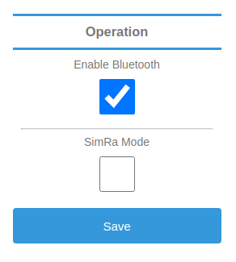
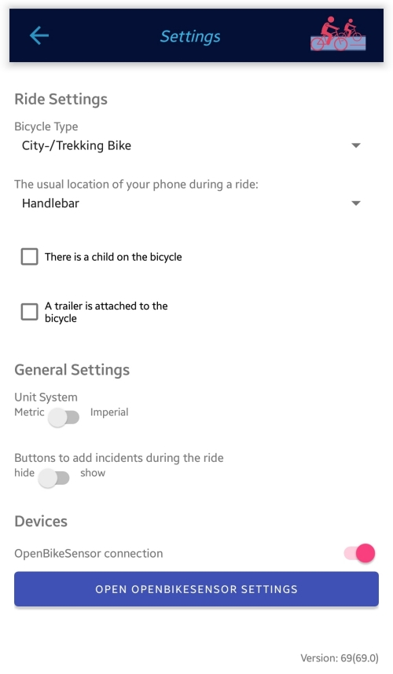
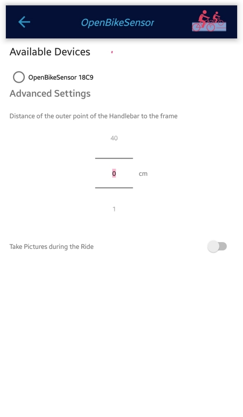
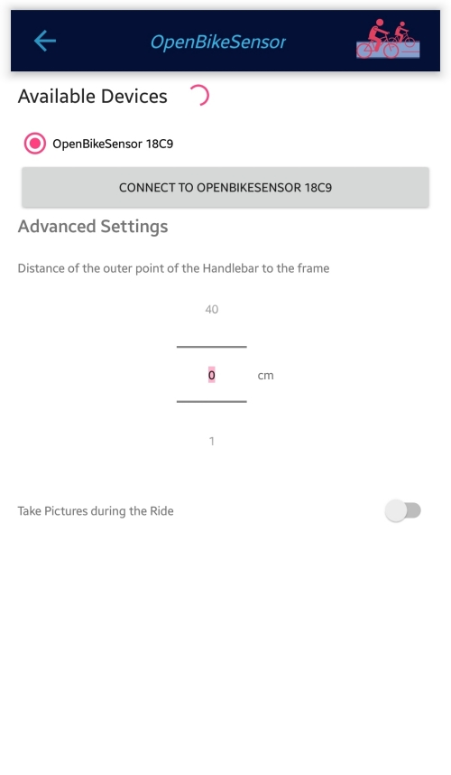
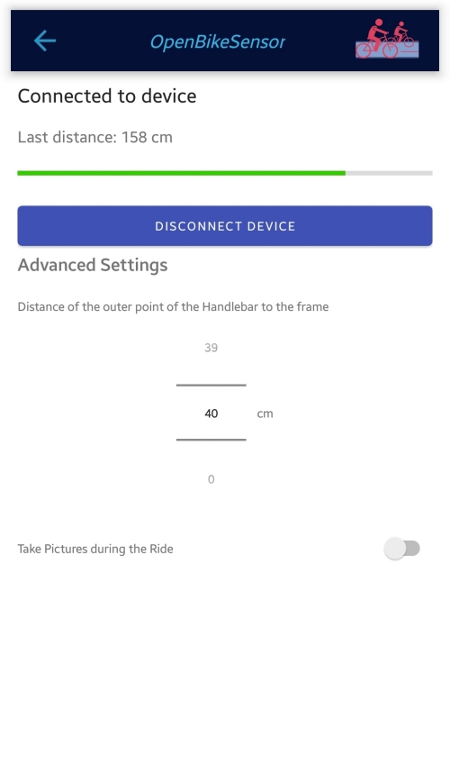

# OpenBikeSensor mit SimRa
Seit der Firmware-Version 0.3 ist es möglich, den OpenBikeSensor per Bluetooth mit der SimRa App zu verbinden. SimRa steht für "Sicherheit im Radverkehr" und ist eine App, die beim Radfahren aktiviert ist und über die Sensoren des Smartphones herauszufinden versucht, wann es gefährliche Situationen gab, die man anschließend beschreiben und bewerten kann. Durch die Kopplung mit dem OpenBikeSensor bekommt die SimRa App zusätzlich die Überholabstände.

## SimRa App installieren
* [Android (Google Play)](https://play.google.com/store/apps/details?id=de.tuberlin.mcc.simra.app)
* [iOS](https://apps.apple.com/de/app/simra/id1459516968)

## OpenBikeSensor konfigurieren
In der Konfigurationsoberfläche des OpenBikeSensor aktiviert man im Untermenü "General" ganz unten Bluetooth im Bereich "Operation":

SimRa Mode: Normalerweise wählt sich der OpenBikeSensor in ein WLAN ein bzw. stellt einen WLAN-Hotspot zur Verfügung, wenn er ohne angeschlossenes Display eingeschaltet wird. Aktiviert man den "SimRa Mode", dann passiert das nicht.

Wenn "SimRa Mode" aktiviert wird, dann startet der OpenBikeSensor nicht im Server Modus, wenn das Display nicht angeschlossen ist.

Nach dem Speichern kann man das Gerät neustarten.

## SimRa App einrichten
Bluetooth muss natürlich auf dem Smartphone aktiviert sein.

### Android
1. App starten.
2. In die Einstellungen gehen und unten OpenBikeSensor aktivieren: 
3. OpenBikeSensor Einstellungen öffnen. Verfügbare Geräte werden gesucht: 
4. Auf den Eintrag mit "OpenBikeSensor xxx" drücken und anschließend auf "Verbinden" drücken. 
5. Der jeweils gemessene Wert sollte jetzt angezeigt werden. 
6. Jetzt muss man noch einstellen, wie breit der Lenker des Fahrrad (von der Mitte) ist.
7. Optional kann aktiviert werden, dass ein Foto mit dem Smartphone gemacht werden soll, wenn der Überholabstand unterschritten wird. Dazu muss das Smartphone natürlich entsprechend am Fahrrad befestigt und ausgerichtet sein.

In der SimRa App wird nun links unten ein blaues Bluetooth Symbol angezeigt, wenn Bluetooth aktiviert ist und ein grünes Symbol, wenn der OpenBikeSensor verbunden werden konnte.

